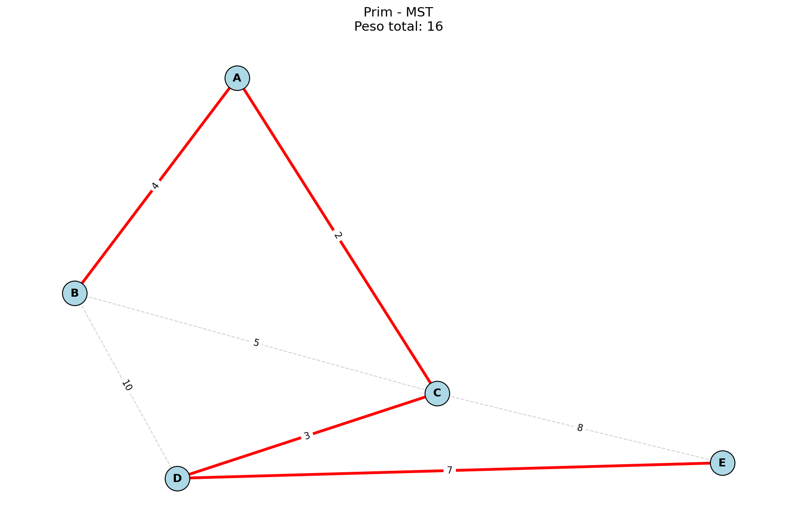
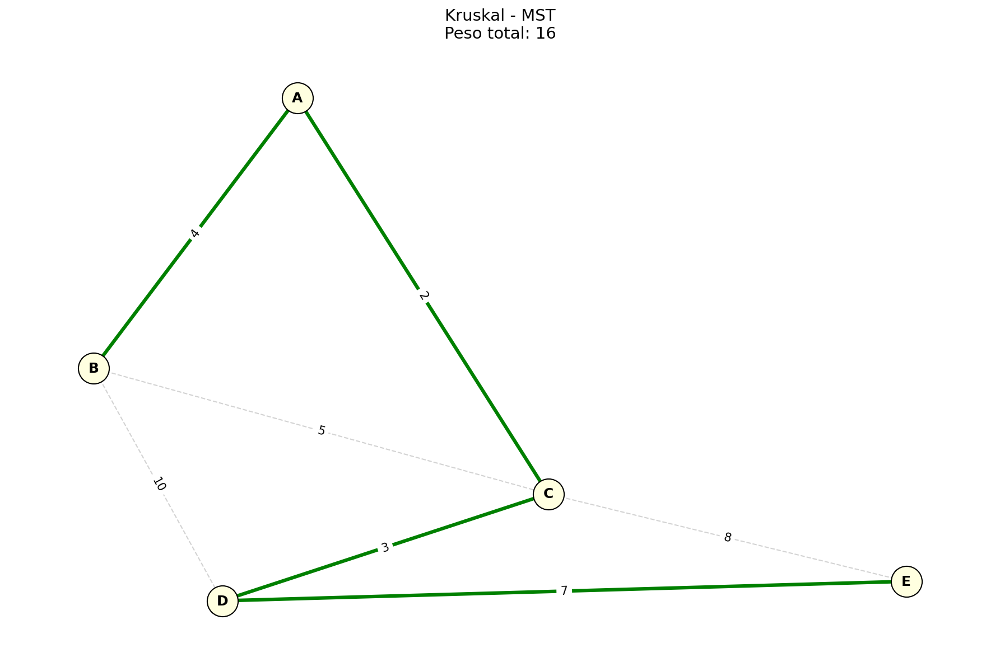
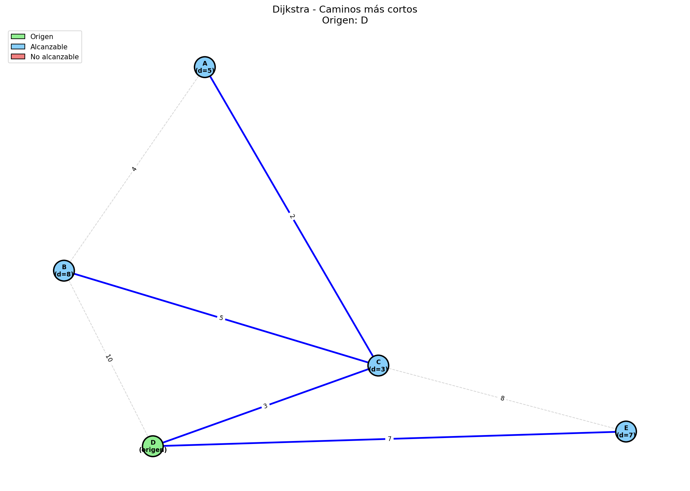
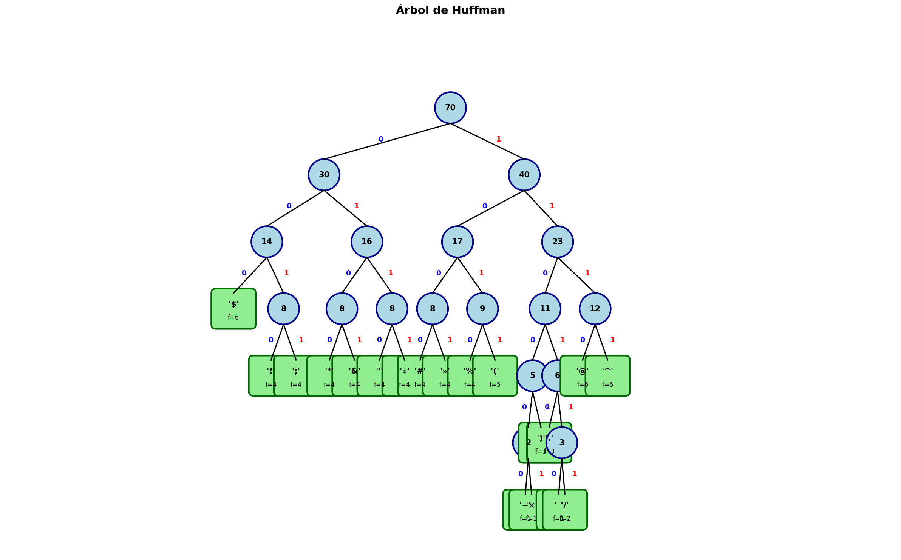
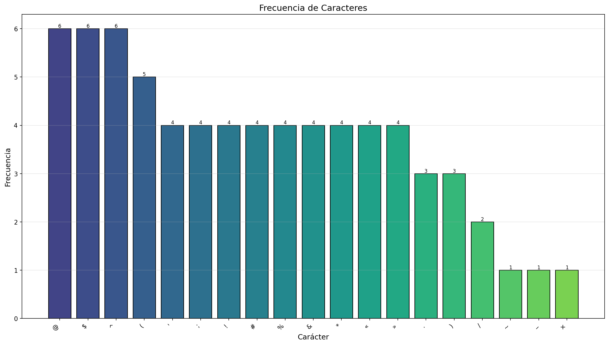

# Proyecto Final
## Alumno Francisco Javier Rojas
### Carnet: 202302368

#### Enlace al repositorio: https://github.com/epxela/-AA-ProyectoFinal_2S2025_202302368
#### Enlace al video: https://youtu.be/ixOUwx5IWxY

## Descripción

Este proyecto implementa cuatro algoritmos fundamentales de teoría de grafos y compresión de datos:

1. **Algoritmo de Prim** - Árbol de Expansión Mínima (MST)
2. **Algoritmo de Kruskal** - Árbol de Expansión Mínima (MST)
3. **Algoritmo de Dijkstra** - Caminos más cortos desde un origen
4. **Algoritmo de Huffman** - Compresión de texto

## Estructura del Proyecto

```
proyecto_final/
├── data/
│   ├── grafos/           
│   └── textos/           
├── src/
│   ├── __init__.py
│   ├── prim.py           
│   ├── kruskal.py        
│   ├── dijkstra.py       
│   └── huffman.py        
├── docs/
│   └── evidencias/       
├── main.py               
├── README.md
└── requirements.txt
```

### OBJETIVO GENERAL 

Desarrollar una aplicación en Python que implemente los algoritmos de Prim, Kruskal, Dijkstra y Huffman para resolver problemas de optimización en grafos y compresión de datos, permitiendo la lectura de archivos externos y la generación de visualizaciones gráficas de los resultados.

### OBJETIVOS ESPECÍFICOS

1. Implementar el algoritmo de Prim para construir el Árbol de Expansión Mínima de un grafo no dirigido y ponderado, minimizando el costo total de conexión entre nodos.
2. Implementar el algoritmo de Kruskal utilizando la estructura Union-Find para obtener el Árbol de Expansión Mínima mediante la selección ordenada de aristas.
3. Implementar el algoritmo de Dijkstra para calcular las distancias mínimas y reconstruir las rutas más cortas desde un nodo origen hacia todos los demás nodos del grafo.
4. Implementar el algoritmo de Huffman para comprimir texto mediante la asignación de códigos binarios de longitud variable según la frecuencia de cada carácter.

## Requisitos

- Python 3.8
- networkx 3.0
- matplotlib 3.7.0
- numpy 1.24.0


## Uso

### Ejecutar el Menú Interactivo

```bash
python main.py
```

El menú presenta las siguientes opciones:
- 0: Salir
- 1: Ejecutar Prim
- 2: Ejecutar Kruskal
- 3: Ejecutar Dijkstra
- 4: Ejecutar Huffman

### Formato de Archivos de Entrada

#### Grafos (CSV)

```csv
origen,destino,peso
A,B,4
A,C,2
B,C,5
B,D,10
C,D,3
D,E,7
```

#### Texto (TXT)

```
Este es un texto de ejemplo del algoritmo hecho por Francisco Rojas.

```

## Archivos de Salida

| Algoritmo | Archivo PNG |
|-----------|-------------|
| Prim | `docs/evidencias/prim_mst.png` |
| Kruskal | `docs/evidencias/kruskal_mst.png` |
| Dijkstra | `docs/evidencias/dijkstra_paths.png` |
| Huffman (árbol) | `docs/evidencias/huffman_tree.png` |
| Huffman (frecuencias) | `docs/evidencias/huffman_freq.png` |

### Evidencias

  
  
  
  
  

## Explicacion teórica

### Prim

El algoritmo de Prim sirve para encontrar el Árbol de Expansión Mínima (MST) de un grafo. Imagina que tienes varias ciudades y quieres conectarlas todas con carreteras gastando el menor dinero posible. Prim empieza desde cualquier ciudad y va "creciendo" el árbol poco a poco. En cada paso, busca la carretera más barata que conecte una ciudad ya incluida con una que todavía no está. Es como si fueras un constructor que siempre elige la opción más económica disponible en ese momento. El algoritmo termina cuando todas las ciudades están conectadas. La clave es que nunca forma ciclos porque siempre conecta algo nuevo con lo que ya tienes. Usa una cola de prioridad (heap) para encontrar rápidamente la arista más barata, lo que le da una complejidad de O(E log V), donde E son las aristas y V los vértices.


### Kruskal

Kruskal también encuentra el Árbol de Expansión Mínima pero con una estrategia diferente. En lugar de crecer desde un punto, ordena todas las carreteras de la más barata a la más cara y las va agregando una por una. El truco está en que solo agrega una carretera si no forma un ciclo con las que ya eligió. Para detectar ciclos usa una estructura llamada Union-Find que agrupa los nodos conectados. Si dos ciudades ya están en el mismo grupo, conectarlas formaría un ciclo, así que la salta. Es como armar un rompecabezas donde vas uniendo las piezas más pequeñas primero, asegurándote de no repetir conexiones. El algoritmo termina cuando tienes V-1 aristas, que es exactamente lo necesario para conectar V ciudades sin ciclos. Su complejidad es O(E log E) principalmente por ordenar las aristas al inicio.

### Dijkstra

Dijkstra encuentra el camino más corto desde un punto de origen hacia todos los demás nodos del grafo. Imagina que estás en una ciudad y quieres saber la ruta más rápida a todas las demás. El algoritmo empieza marcando la distancia al origen como 0 y todas las demás como infinito. Luego, visita el nodo más cercano que aún no ha visitado y actualiza las distancias de sus vecinos si encuentra un camino más corto pasando por él. Es como una onda que se expande desde el origen, siempre avanzando por el camino más corto disponible. Guarda también el nodo anterior de cada uno para poder reconstruir la ruta completa al final. Usa un heap para elegir eficientemente el siguiente nodo a visitar. La limitación es que no funciona con pesos negativos. Su complejidad es O((V+E) log V) y es muy usado en GPS y navegación.

### Huffman

Huffman es un algoritmo de compresión que asigna códigos binarios a cada carácter de un texto. La idea es simple: las letras que aparecen más veces reciben códigos más cortos, y las que aparecen poco reciben códigos más largos. Así el texto comprimido ocupa menos espacio. Para lograrlo, construye un árbol binario de abajo hacia arriba. Primero crea un nodo para cada letra con su frecuencia. Luego, toma los dos nodos con menor frecuencia, los une bajo un nodo padre cuya frecuencia es la suma de ambos, y repite hasta que queda un solo árbol. Los códigos se generan recorriendo el árbol: cada vez que vas a la izquierda agregas un 0, y a la derecha un 1. Cuando llegas a una hoja, ese es el código de esa letra. Es un algoritmo greedy porque siempre une los más pequeños primero. Su complejidad es O(n + k log k) donde n es el largo del texto y k la cantidad de caracteres únicos.

### CONCLUSIÓN
El desarrollo de este proyecto permitió comprender de manera práctica el funcionamiento de cuatro algoritmos fundamentales en ciencias de la computación. A través de la implementación de Prim y Kruskal se entendió cómo resolver el problema del Árbol de Expansión Mínima utilizando dos enfoques distintos: uno que crece desde un nodo inicial y otro que selecciona aristas ordenadas por peso. Ambos algoritmos llegan al mismo resultado óptimo pero con estrategias diferentes, demostrando que un mismo problema puede tener múltiples soluciones válidas.  

Con Dijkstra se logró resolver el problema de caminos más cortos, un algoritmo ampliamente utilizado en aplicaciones reales como sistemas de navegación y redes de comunicación. La implementación permitió entender la importancia de las estructuras de datos como el heap para optimizar el rendimiento.  

El algoritmo de Huffman mostró cómo la teoría de árboles binarios se aplica en la compresión de datos, asignando códigos eficientes según la frecuencia de aparición de cada carácter. Este principio es la base de muchos formatos de compresión actuales.  

Finalmente, el proyecto reforzó habilidades de programación en Python, manejo de archivos, visualización de datos y documentación de código, competencias esenciales para cualquier profesional en el área de desarrollo de software.